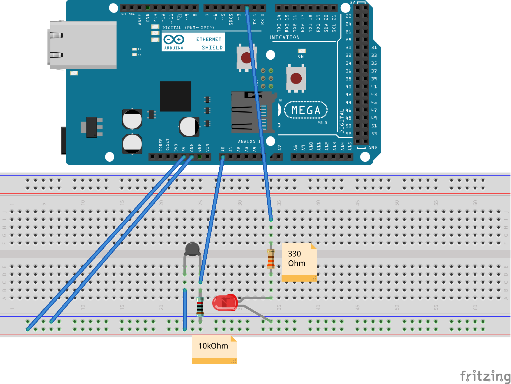

# Alexa and Arduino integration example

## Components and tools
- Arduino Mega2560
- Arduino Ethernet shield
- [aREST library](https://github.com/marcoschwartz/aREST/tree/master/examples)
- [Fritzing](https://fritzing.org/home/)
- Alexa Developer Console
- Amazon Lambda

## Deployment

### Arduino part
- Build the schematics

- Enable aREST library in Arduino IDE
- Enable Ethernet library in Arduino IDE
- Modify IPAddress value in Arduino_REST.ino 
- Upload Arduino_REST.ino code
- Note: aREST library will launch a Web server on the port 80 on the Arduino. It might be required to enable port forwarding of port 80 via home router to allow Lambda function access to the REST endpoints

### Lambda part
- Open AWS Console, select region and Lambda service
- Create Function - Author from scratch; specify Function name and Runtime = Python 3.7; Create a new role with basic Lambda permissions
- In the Configuration view, Add trigger - Alexa Skills Kit. Enable Skill ID verification. Proceed with Alexa part 

### Alexa part
- Connect to Alexa Developer Console
- Specify Skill Name, Select "Custom" model and "Provision Your Own" method, click Create Skill
- Choose "Start from scratch" Template
- Go to Endpoint, select AWS Lambda ARN
- Copy your Skill ID, copy it and switch back to AWS Lambda console - Paste the Skill ID
- Copy AWS Lambda function ARN from the AWS Lambda console, switch back to Alexa Console and paste it to the Default Region field
- Go to JSON Editor, paste contect of the alexa_skill.json
- Click on Build Model

### Lambda part - 2
- Open newly created function in AWS Lambda console
- Paste lambda_function.py content 
- Modify url value to point to the external IP of the Arduino board
- Save; Actions - Publish New Version

### Testing
- In the Alexa Development Console, switch to Test window
- Type or say "Open my magic wand"
- Type or say "Set light to 255" - the LED should turn on
- Type or say "What is the temperature in my room in Kelvin"

# Author: Gregory Touretsky